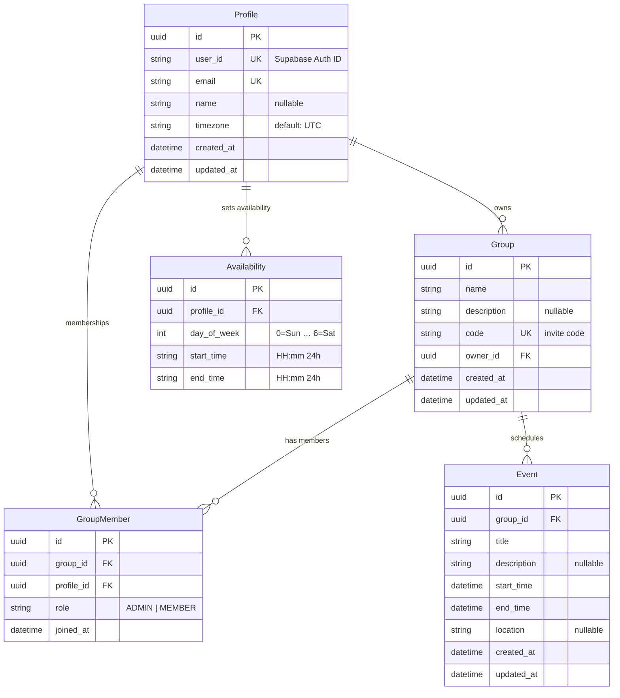

# Entity Relationship Diagram

## Relationship Summary

| Relationship               | Type        | Description                                     |
| -------------------------- | ----------- | ----------------------------------------------- |
| **Profile → Group**        | One-to-Many | A profile can own many groups (`owner_id`)      |
| **Profile → GroupMember**  | One-to-Many | A profile can be a member of many groups        |
| **Profile → Availability** | One-to-Many | A profile can have many availability time slots |
| **Group → GroupMember**    | One-to-Many | A group can have many members                   |
| **Group → Event**          | One-to-Many | A group can have many scheduled events          |

## Constraints

- `GroupMember` has a **unique composite index** on `(group_id, profile_id)` — a profile can only join a group once.
- `Availability` has an **index** on `profile_id` for fast lookups.
- `Profile.user_id` is unique and maps to the **Supabase Auth** user ID.
- `Group.code` is unique and serves as the **invite/join code**.
