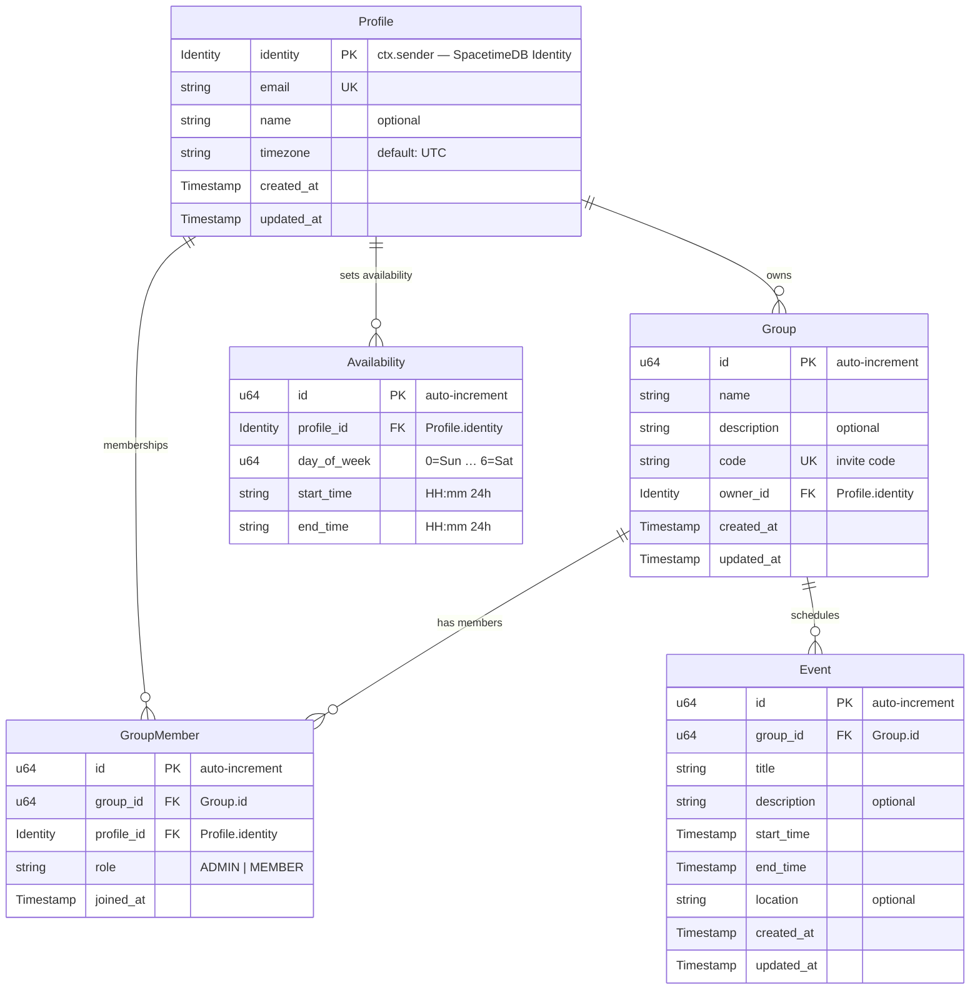

# Entity Relationship Diagram

> **Note:** This ERD uses SpacetimeDB-native types. `Identity` is the SpacetimeDB user
> identity (from `ctx.sender`). All other IDs are `u64` auto-increment. There are no UUIDs.

## Relationship Summary

| Relationship               | Type        | Description                                     |
| -------------------------- | ----------- | ----------------------------------------------- |
| **Profile → Group**        | One-to-Many | A profile can own many groups (`owner_id`)      |
| **Profile → GroupMember**  | One-to-Many | A profile can be a member of many groups        |
| **Profile → Availability** | One-to-Many | A profile can have many availability time slots |
| **Group → GroupMember**    | One-to-Many | A group can have many members                   |
| **Group → Event**          | One-to-Many | A group can have many scheduled events          |

## SpacetimeDB Type Mapping

| ERD Type    | SpacetimeDB Type                 | Notes                                                     |
| ----------- | -------------------------------- | --------------------------------------------------------- |
| `Identity`  | `t.identity()`                   | User identity from `ctx.sender`, used as PK for `Profile` |
| `u64`       | `t.u64().primaryKey().autoInc()` | Auto-increment primary key for other tables               |
| `string`    | `t.string()`                     | Text fields                                               |
| `Timestamp` | `t.timestamp()`                  | Use `ctx.timestamp` for current time in reducers          |
| `optional`  | `.optional()` modifier           | e.g., `t.string().optional()`                             |

## Constraints

- `GroupMember` has an **index** on `group_id` for fast lookups (`group_member_group_id`).
- `GroupMember` has an **index** on `profile_id` for fast lookups (`group_member_profile_id`).
- Uniqueness of `(group_id, profile_id)` is enforced in the **reducer logic** (check before insert).
- `Availability` has an **index** on `profile_id` for fast lookups (`availability_profile_id`).
- `Group` has an **index** on `owner_id` for fast lookups (`group_owner_id`).
- `Event` has an **index** on `group_id` for fast lookups (`event_group_id`).
- `Profile.identity` is the primary key (unique by definition).
- `Group.code` uniqueness is enforced in the **reducer logic** (check before insert).

## Index Naming Convention

All indexes follow the pattern `{table_name}_{column_name}` to avoid name collisions across the module:

| Table          | Index Name                | Column      |
| -------------- | ------------------------- | ----------- |
| `Group`        | `group_owner_id`          | `ownerId`   |
| `GroupMember`  | `group_member_group_id`   | `groupId`   |
| `GroupMember`  | `group_member_profile_id` | `profileId` |
| `Availability` | `availability_profile_id` | `profileId` |
| `Event`        | `event_group_id`          | `groupId`   |
